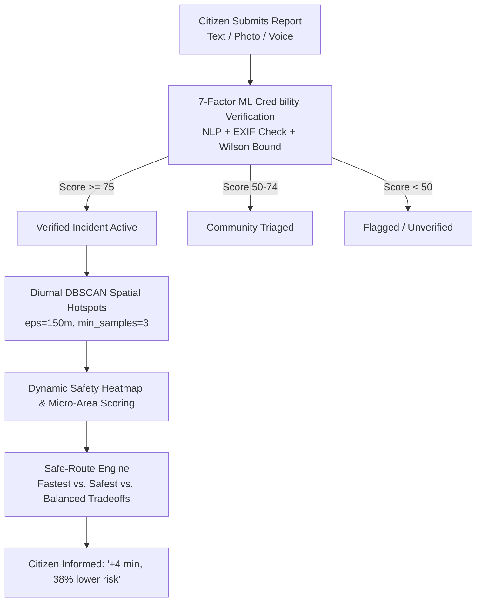
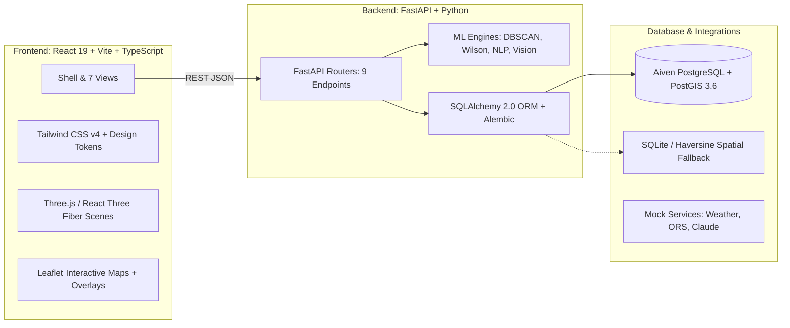

# CityCompass — "Your city, verified."

> **Pune Smart City Platform & Credibility Verification Engine**  
> Turning raw citizen reports and urban data into verified, actionable navigation and safety insights. Zero Docker required.

- **Live Production App (Vercel):** [https://city-life-seven.vercel.app/](https://city-life-seven.vercel.app/)
- **Live Production API (Render):** [https://city-life-qli2.onrender.com/](https://city-life-qli2.onrender.com/)
- **API Health Check:** [https://city-life-qli2.onrender.com/health](https://city-life-qli2.onrender.com/health)

---

## 🌟 The Core Differentiator: The Verified Loop

Most smart city portals suffer from **unverified noise**: duplicate reports, subjective rants, and spam. Navigation apps optimize purely for **speed**, ignoring real-time lit corridors or danger clusters.

**CityCompass closes the loop:**


---

## 📐 Architecture



---

##  Honest Data Disclosure (Rule #5)

In accordance with strict hackathon transparency standards:

| Data Element | Status | Source & Description |
| :--- | :--- | :--- |
| **City Coordinates & Corridors** | **REAL** | Pune coordinates (`18.5204, 73.8567`), FC Road, JM Road, Kothrud, Hinjewadi, Viman Nagar corridor geometries. |
| **Landmarks & Heritage Sites** | **REAL** | Shaniwar Wada, Aga Khan Palace, Sinhagad Fort, Pataleshwar Cave, Raja Dinkar Kelkar Museum with historical facts. |
| **Citizen Reports & Incidents** | **SYNTHETIC** | ~300 realistic reports with simulated spatial clusters, temporal distributions, sentiment, and photos. Marked with `is_synthetic: true`. |
| **DBSCAN Hotspots** | **REAL ML** | Computed on-the-fly via Scikit-Learn DBSCAN using Haversine metric on incidents for 4 diurnal time buckets. |
| **Routing Alternatives** | **HYBRID** | ORS realistic polyline geometries with densification and dynamic risk penalty evaluation. |
| **Weather & LLM Narratives** | **DETERMINISTIC FALLBACK** | Diurnal atmospheric simulation & structured heritage narratives with instant offline responses (`USE_MOCKS=true`). |

---

## 🚀 Quick Start (Containerless Setup)

### Prerequisites
- **Python 3.11+ or 3.14+**
- **Node.js 18+** & `npm`

### 1. Backend Setup
```powershell
cd backend

# Create and activate virtualenv
python -m venv venv
.\venv\Scripts\Activate.ps1

# Install dependencies
pip install -r requirements.txt

# Run migrations (already pointed to your database in .env)
alembic upgrade head

# Seed initial landmarks, incidents, and DBSCAN hotspots
python -m seed.run

# Start backend dev server
uvicorn app.main:app --host 127.0.0.1 --port 8000 --reload
```

Backend is live at `http://127.0.0.1:8000` (Interactive Swagger Docs at `http://127.0.0.1:8000/docs`).

---

### 2. Frontend Setup
```powershell
cd frontend

# Install dependencies
npm install

# Start development server
npm run dev -- --host 127.0.0.1 --port 5173
```

Frontend is live at `http://127.0.0.1:5173`.

---

## ⚙️ Environment Variables Reference

| Variable | Default | Purpose |
| :--- | :--- | :--- |
| `DATABASE_URL` | `postgresql+psycopg2://...` | Connection URI for PostgreSQL (Aiven) or SQLite (`sqlite:///./citycompass.db`). |
| `USE_MOCKS` | `true` | Enables zero-API-key offline mode for ORS, OpenWeather, and Claude. |
| `CITY_NAME` | `Pune` | Primary target municipality. |
| `CITY_LAT`, `CITY_LNG` | `18.5204`, `73.8567` | Center coordinates. |
| `CITY_BBOX` | `18.44,73.75,18.62,73.96` | Bounding box for Pune metropolitan area. |
| `RATE_LIMIT_PER_MIN` | `60` | SlowAPI rate limiting per client IP. |
| `CORS_ORIGINS` | `http://localhost:5173` | Allowed frontend origins. |

---

## 🧪 Running Automated Tests

All tests execute against the connected database:
```powershell
cd backend
.\venv\Scripts\pytest.exe -v
```
Output:
- `test_api.py`: Validates `/health`, `/places`, `/reports`, and `/routes/safe`.
- `test_verification.py`: Validates the 7-factor credibility score and Wilson lower bound.
- `test_route_ranker.py`: Validates route risk densification and safety ranking.
- `test_safety_score.py`: Validates Gaussian kernel spatial safety decay.
